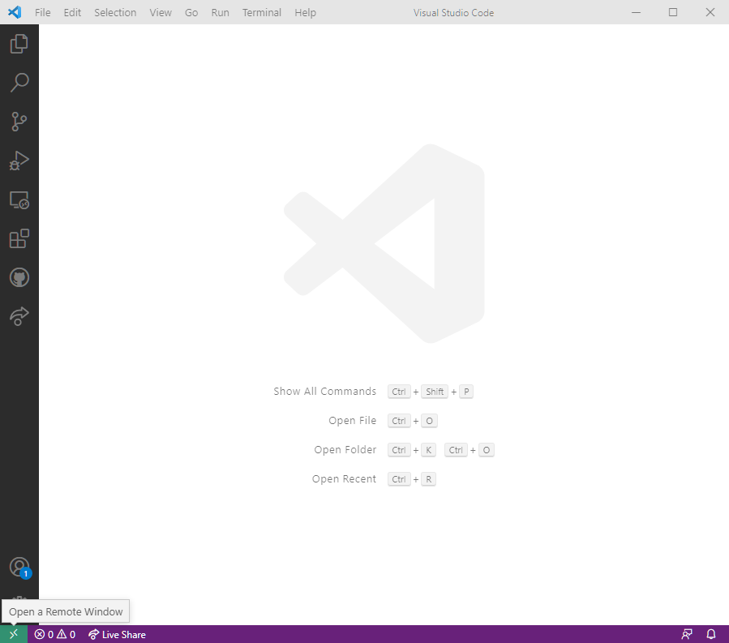
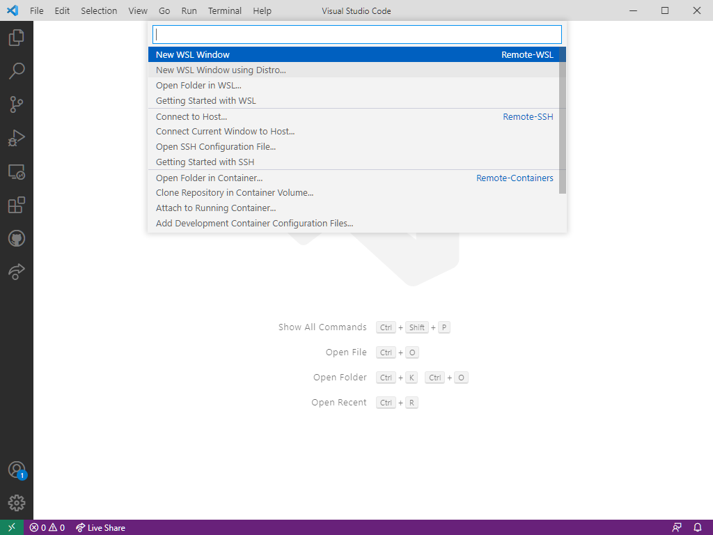
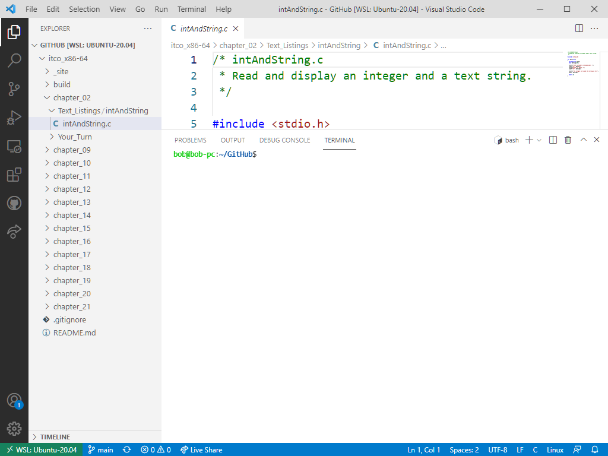

# Linux Programming in Windows

## Windows Subsystem for Linux

If you're using Windows 10 or 11, Microsoft provides some very nice tools that can be used for all the programming in the x86-64 version of *Introduction to Computer Organization*.

The first step is to [install Windows Subsystem for Linux (WSL)](https://docs.microsoft.com/en-us/windows/wsl/install). I went with the default Linux distribution, Ubuntu 20.04 LTS.

WSL only provides a command line interface. You cannot use the mouse in the WSL window, which means that you cannot copy and paste between the Linux side and the Windows side. However, Microsoft offers a very nice editor, [Visual Studio Code (VSC)](https://code.visualstudio.com/), that interfaces very nicely with WSL.

## Visual Studio Code

When you launch Visual Studio Code, you'll see small icon in the lower, left corner that connects you to your Windows Subsystem for Linux installation.

Clicking on that icon brings up a menu that allows you to open a new window to you Linux distribution.

Then click on the top icon in the black menu on the left and click on `Open Folder` to bring up a list of the folders in your home directory on your WSL system in Windows Explorer.

Now you can select the directory an the file you want to work on.

Notice that Visual Studio Code also opens a terminal pane in its window for you to use the command line in your Linux distro.

One of the many nice features of using VSC with WSL is that you can copy and paste between files that you open in the Windows side and Linux side.
