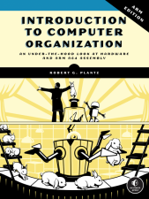
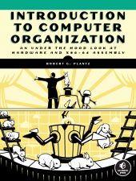

---
# Feel free to add content and custom Front Matter to this file.
# To modify the layout, see https://jekyllrb.com/docs/themes/#overriding-theme-defaults

layout: home
---
Here are some resources to help you get the most from reading my books, Introduction to Computer Organization:

[ARM version](./itco_ARM/)  |  [x86-64 version](./itco_x86-64/)
:--------------------------:|:--------------------------------:|
 | 

These include:
- Source code for the example programs in the book; I don't include the compiler-generated assembly language because you can generate those files from the provided C/C++ source code files.
- Solutions to most of the **Your Turn** exercises
- A list of corrections to the text; if you discover any errors, please [send me email](<mailto:bob@computer.org> "email at bottom"). I like to give credit to the person who finds the error; please let me know if it's okay to use your name.
